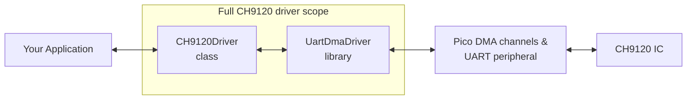
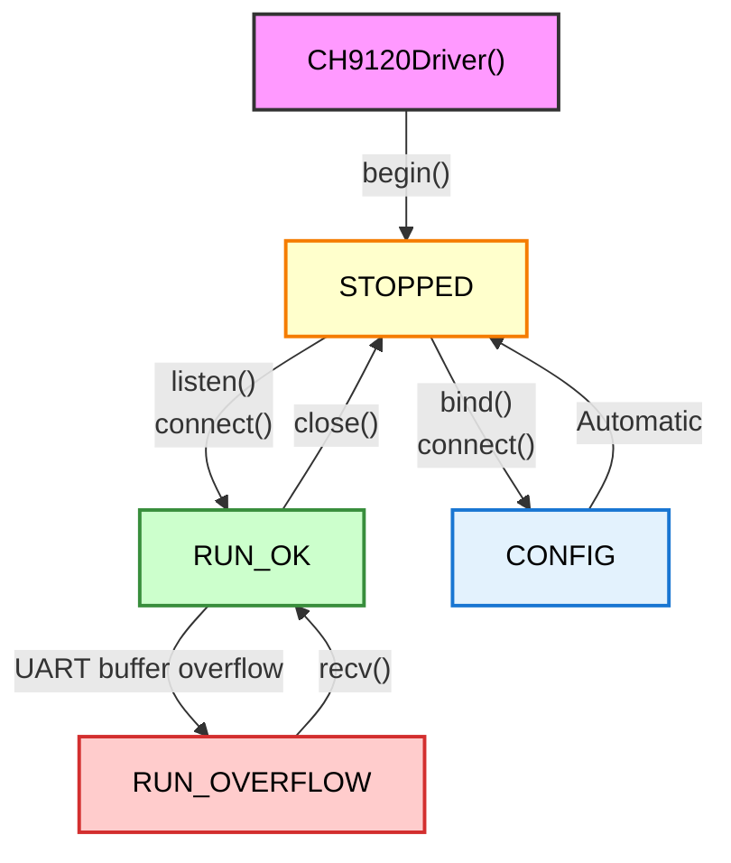

# UART-to-Ethernet CH9120 Driver for RP2040 & RP2350

## Introduction

`CH9120Driver` is a C++ driver for the [WCH CH9120 UART-to-Ethernet IC](https://www.wch-ic.com/downloads/CH9120DS1_PDF.html), designed specifically for the **Raspberry Pi Pico chips (RP2040/RP2350) using Pico-SDK and FreeRTOS**.

It provides a high-level, thread-safe **BSD socket-style API** (`connect`, `bind`, `listen`, `accept`, `send`, `recv`) that abstracts away the low-level complexities of the chip's serial communication and AT command configuration. The driver supports all four operating modes of the CH9120:
*   TCP Client
*   TCP Server
*   UDP Client
*   UDP Server

The driver default configuration is adapted to the [Waveshare RP2350-ETH](https://www.waveshare.com/wiki/RP2350-ETH), a tiny dev board that enables Ethernet-based application development for the RP2350.

### Problem Solved & Solution Architecture

The CH9120 module presents several integration challenges that this driver addresses with a layered, event-driven architecture natively built on top of FreeRTOS. The vendor-provided C library is very bare-bones - this project tries and offer a nicer UX along with better responsiveness & performance:

1.  **High-Performance I/O Handling:** Pico-SDK doesn't provide a native UART HAL suited for asynchronous high data throughput. This driver integrates the [`UartDmaDriver`](https://github.com/pierrejay/pico-freertos-UartDmaDriver) component for DMA-based UART communication, capable of processing large TCP frames (>1500 bytes) at baud rates up to 921600 bps with minimal CPU load and no data loss.

2.  **Automated Operations Management:** The CH9120's single UART channel handles both data transport and configuration with custom AT commands, requiring mode/baud rate switching and careful state management. The driver automates the entire lifecycle: configuration protocol, UART peripheral control and module boot/reset sequences through `setConfig()` with a user-friendly `NetworkConfig` struct.

3.  **Hardware State Abstraction:** Without direct state feedback mechanism provided by the CH9120, the driver manages hardware pins (`CFG`, `RES`), timings, and I/O states to accurately reflect status and handle errors like buffer overflows in real-time.

4.  **Socket API Implementation:** The CH9120 only provides a transparent data pipe, the driver adds on top a complete BSD-style socket API (`connect`, `bind`, `listen`, `send`, `recv`) with connection management, data chunking, timeout and error handling to easily interface with network libraries & applications (HTTP client/server, Modbus TCP stack...).

5.  **FreeRTOS-Native Design:** Built specifically for real-time FreeRTOS applications, with thread-safe resource access, event queues for data RX & link status notifications, and "blocking" API functions with timeouts for efficient task management (no polling, no busy wait, fully async logic: the driver wakes up user tasks only when data is ready to fetch).

## Basic Usage Example (TCP Client)

Here is a minimal example of a FreeRTOS task that connects to a remote server, sends a simple HTTP request, and receives the response.

```cpp
#include "CH9120Driver.hpp"
#include "FreeRTOS.h"
#include "task.h"
#include <cstdio>

// Global driver instance
CH9120Driver socket(uart1); // Using default pins for Waveshare ETH Module

void clientTask(void* params) {
    // 1. Initialize the driver
    if (socket.begin() != CH9120Driver::SUCCESS) {
        printf("Failed to initialize driver\n");
        vTaskDelete(NULL);
        return;
    }

    // 2. Define the network configuration
    CH9120Driver::NetworkConfig config = {
        .mode = CH9120Driver::Mode::TCP_CLIENT,
        .targetIp = {192, 168, 1, 100}, // Remote server IP
        .targetPort = 80,               // Remote server port
        .localPort = 8000,              // Local port for the CH9120
        .useDhcp = true
    };

    // 3. Connect to the server
    printf("Connecting to server...\n");
    int result = socket.connect(config, pdMS_TO_TICKS(10000)); // 10-second timeout
    if (result != 0) {
        printf("Connection failed with errno: %d\n", -result);
        vTaskDelete(NULL);
        return;
    }
    printf("Connected!\n");

    // 4. Send and receive data
    const char* request = "GET / HTTP/1.1\r\nHost: example.com\r\n\r\n";
    uint8_t buffer[512];

    socket.send(reinterpret_cast<const uint8_t*>(request), strlen(request));
    int bytesReceived = socket.recv(buffer, sizeof(buffer), pdMS_TO_TICKS(5000)); // 5-second timeout

    if (bytesReceived > 0) {
        printf("Received %d bytes:\n%.*s\n", bytesReceived, bytesReceived, buffer);
    }

    // 5. Close the connection
    socket.close();
    printf("Connection closed.\n");

    vTaskDelete(NULL);
}
```

## Architecture & Core Concepts

### Architecture Overview

The driver abstracts hardware complexity through three key components:


*   **Your Application:** Interacts with the simple socket API.
*   **CH9120Driver class:** Translates socket calls into the appropriate data streams and configuration commands for the CH9120.
*   **UartDmaDriver library:** Manages the underlying real-time UART data transport using DMA.

### Driver State Machine

The driver operates using a simple state machine to manage its lifecycle. All transitions are thread-safe which means protected against switching one mode to another while it is already in a critical section (e.g. config in progress, or cleaning up previous transmission).



*   **`STOPPED`**: The initial state. The driver is initialized but not communicating.
*   **`CONFIG`**: A temporary state entered during `setConfig()`, `bind()` or the first step of `connect()`. The driver communicates with the CH9120 at a low baud rate (9600) bypassing DMA to send configuration commands and receive ACKs.
*   **`RUN_OK`**: The active state. The driver is ready to send and receive data over the network.
*   **`RUN_OVERFLOW`**: A fault state indicating the underlying UART receive buffer has overflowed. The driver automatically recovers to `RUN_OK` once enough space is freed up in the buffer with `recv()`.

### The "Socket" Abstraction

The CH9120 module itself does not have a true multi-socket TCP/IP stack. It provides a single, transparent serial-to-network data pipe forwarding only TCP/UDP payloads in both directions. This driver builds a **socket-like abstraction** on top of this pipe to provide a familiar programming model. For example, `accept()` in server mode doesn't block waiting for a new connection in the same way a software TCP/IP stack would; it primarily ensures the driver is in a listening state, as the CH9120 handles the actual connection behind the scenes. 

## Socket API Reference

### Constructor

Create a CH9120Driver instance with UART and pin configuration:

```cpp
// Constructor: create instance with UART settings and pin configuration
CH9120Driver::CH9120Driver(uart_inst_t* uart, uint32_t baudRate = 115200,
                          uint8_t txPin = 20, uint8_t rxPin = 21, 
                          uint8_t cfgPin = 18, uint8_t resPin = 19, uint8_t statusPin = 17)
```

**Usage Examples:**
```cpp
// Default Waveshare RP2350-ETH pinout
CH9120Driver eth_socket(uart1);  // Uses default 115200 bps and pins 20,21,18,19,17

// Custom UART and baud rate
CH9120Driver eth_socket(uart0, 921600);

// Fully custom configuration
CH9120Driver eth_socket(uart0, 115200, 0, 1, 2, 3, 4);  // TX=0, RX=1, CFG=2, RES=3, STATUS=4
```

### `NetworkConfig` Structure

This structure holds all the necessary parameters to configure the CH9120.

```cpp
struct NetworkConfig {
    uint8_t localIp[4];     // Local (CH9120) IP e.g. 192.168.0.100
    uint8_t gateway[4];     // Gateway IP e.g. 192.168.0.1
    uint8_t subnetMask[4];  // Subnet mask e.g. 255.255.255.0
    bool useDhcp;           // true to enable DHCP (will ignore localIp)
    uint8_t targetIp[4];    // Remote server IP (in Client mode)
    uint16_t localPort;     // Local TCP/UDP port (Client source/Server target)
    uint16_t targetPort;    // Remote TCP/UDP port (in Client mode)
    Mode mode;              // TCP_SERVER, TCP_CLIENT, UDP_SERVER, UDP_CLIENT
};
```

#### Optional Fields

Some fields are optional depending on the mode and DHCP settings:
- **Server mode**: `targetIp` and `targetPort` are not used
- **DHCP enabled**: `localIp`, `gateway`, and `subnetMask` are ignored

For optional fields, you can either use placeholders (avoid `0.0.0.0` as it's an invalid IP) or start with default values and modify only what you need.

**Approach 1: Designated initializers with placeholders**
```cpp
// TCP Server - targetIp/targetPort not used
CH9120Driver::NetworkConfig server_config = {
    .mode = CH9120Driver::Mode::TCP_SERVER,
    .localIp = {192, 168, 1, 100},
    .targetIp = {192, 168, 1, 1},       // Placeholder
    .localPort = 8000,
    .targetPort = 80,                   // Placeholder
    .useDhcp = false
};
```

**Approach 2: Default instance + field modification**
```cpp
// Start with defaults, change only what's needed
CH9120Driver::NetworkConfig config;
config.mode = CH9120Driver::Mode::TCP_CLIENT;
config.targetIp = {192, 168, 1, 100};
config.targetPort = 80;
config.useDhcp = true;  // localIp will be ignored
```

### Error Handling

The socket API functions return `0` on success and a negative `errno` value (`constexpr int`) on failure, compatible with standard Linux socket error codes. Those error codes are enumerated in the `CH9120Errno.hpp` file (due to some headers already defining `errno` codes as defines, we unfortunately cannot use constexpr or enums, so we just use raw defines as well).

| `errno` Code      | Value | Meaning                               |
| ----------------- | ----- | ------------------------------------- |
| `ENOTSOCK`        | 108   | Driver not initialized (`begin()` not called). |
| `EINVAL`          | 22    | Invalid argument (e.g., bad config).  |
| `EBUSY`           | 16    | Driver is busy with another operation. |
| `ETIMEDOUT`       | 116   | Operation timed out.                  |
| `ECONNREFUSED`    | 111   | Connection was refused by the peer.   |
| `ENOTCONN`        | 128   | The socket is not connected.          |
| `EISCONN`         | 127   | The socket is already connected.      |
| `EMSGSIZE`        | 122   | The message to send is too large.     |
| `ENOBUFS`         | 105   | Receive buffer overflowed.            |

### Client Workflow

1.  **`int connect(const NetworkConfig& config, TickType_t timeout)`**
    *   Configures the CH9120 (if not already configured with the same settings) and starts communication.
    *   In TCP mode, this is a **pending call** (the calling function yields without blocking other threads) that waits for the hardware `STATUS` pin to indicate a successful connection, or until the timeout expires.

2.  **`int send(const uint8_t* data, size_t len, TickType_t timeout)`**
    *   Sends data over the network. It can pend if the underlying DMA buffer is full, until space is available or the timeout expires.

3.  **`int recv(uint8_t* buffer, size_t maxLen, TickType_t timeout)`**
    *   Receives data. If no data is immediately available, it yields until data arrives or the timeout expires.

### Server Workflow

1.  **`int bind(const NetworkConfig& config)`**
    *   Configures the CH9120 with the server settings (e.g., `TCP_SERVER` mode and `localPort`). This function **does not** start communication.

2.  **`int listen(int backlog = 1)`**
    *   Puts the driver into the `RUN_OK` state, enabling it to accept incoming connections handled by the CH9120 hardware.

3.  **`int accept(TickType_t timeout)`**
    *   **Important:** This function is largely a placeholder for API compatibility. Since the CH9120 handles connections automatically, `accept()` simply verifies the server is in a listening state. The first call that truly waits for client activity is `recv()`.

### Common Methods

*   **`void close()`**: Stops communication, puts the driver in the `STOPPED` state, and clears connection status.
*   **`bool isConnected()`**: Returns the current hardware link status. In TCP Client mode, this is based on the `STATUS` pin. In Server modes, it returns `true` as long as the driver is listening, as the CH9120 does not expose the connection state of individual clients.

### TX Buffer Configuration & Behavior

The driver uses a dedicated DMA-based transmission buffer for efficient, zero-CPU data sending:

**Buffer Details:**
- **Default Size:** 256 bytes (configurable at compile-time)
- **DMA-Based:** Uses dedicated DMA channel for hardware-accelerated transmission
- **Thread-Safe:** Multiple tasks can call `send()` concurrently (serialized internally)
- **Asynchronous:** `send()` returns immediately after queuing data for transmission

**Behavior:**
- Maximum single `send()` operation is limited by buffer size
- If data exceeds buffer capacity, `EMSGSIZE` error is returned
- Transmission completion is handled automatically via DMA interrupts
- Flow control uses FreeRTOS semaphores to prevent data corruption

**Performance:** Zero CPU overhead during transmission - once your data is copied into the internal buffer, the DMA hardware handles all data transfer while the CPU remains free for other tasks.

## Advanced Usage: Link Status Monitoring

The driver can notify your application in real-time about connection state changes in Client mode (connected/disconnected to remote server). However, note that it isn't actively managing the connection: the CH9120 handles this automatically in the background.

It uses a FreeRTOS queue to send `LinkEvent` messages which allow user tasks to pend while waiting for a new event (`xQueueReceive` with timeout).

```cpp
// The event structure sent to the queue
struct LinkEvent {
    LinkEventType type; // LINK_CONNECTED or LINK_DISCONNECTED
    uint64_t timestamp_us;
};

// Get the queue handle from the driver
QueueHandle_t queue = socket.getLinkEventQueueHandle();
```

**Example Monitoring Task:**
```cpp
void linkMonitorTask(void* param) {
    CH9120Driver* socket = static_cast<CH9120Driver*>(param);
    CH9120Driver::LinkEvent event;

    while (true) {
        // Block until a link event is received
        if (xQueueReceive(socket->getLinkEventQueueHandle(), &event, portMAX_DELAY)) {
            if (event.type == CH9120Driver::LINK_CONNECTED) {
                printf("Link is UP!\n");
                // Turn on a status LED, for example
            } else {
                printf("Link is DOWN!\n");
                // Turn off status LED
            }
        }
    }
}
```

## Advanced Usage: Raw Event-Driven API

For applications that need more control or don't require the socket abstraction, the driver provides a raw event-driven API that directly exposes the underlying UART data events. This approach offers more flexibility for custom protocols.

### Raw API Methods

```cpp
// Configure the CH9120 without socket setup
CH9120Driver::Result result = driver.setConfig(config);

// Start/stop raw data transmission
driver.startRxTx();
driver.stopRxTx();

// Direct data access (no socket overhead)
driver.sendRaw(data, length, pdMS_TO_TICKS(5000));
size_t bytesRead = driver.readRaw(buffer, maxSize);

// Access underlying event queues
QueueHandle_t dataQueue = driver.getDataEventQueueHandle();    // UART data events
QueueHandle_t linkQueue = driver.getLinkEventQueueHandle();    // Link status events
```

### Event Types

The raw API uses two types of events from the underlying `UartDmaDriver`:

```cpp
// UART Data Events
struct Event {
    EventType type;        // EVT_DATA or EVT_OVERFLOW
    size_t size;          // Bytes available to read
    bool silenceFlag;     // True if triggered by communication silence
    uint64_t timestampUs; // Hardware timestamp
};

// Link Status Events  
struct LinkEvent {
    LinkEventType type;   // LINK_CONNECTED or LINK_DISCONNECTED
    uint64_t timestamp_us; // Timestamp from boot
};
```

### Complete Raw API Example

```cpp
#include "CH9120Driver.hpp"
#include "UartDmaDriver.hpp" // For EVT_DATA, EVT_OVERFLOW constants

CH9120Driver driver(uart1);

void rawNetworkTask(void* params) {
    // 1. Initialize and configure
    if (driver.begin() != CH9120Driver::SUCCESS) {
        printf("Driver init failed\n");
        vTaskDelete(NULL);
        return;
    }

    CH9120Driver::NetworkConfig config = {
        .mode = CH9120Driver::Mode::TCP_CLIENT,
        .targetIp = {192, 168, 1, 100},
        .targetPort = 80,
        .useDhcp = true
    };

    if (driver.setConfig(config) != CH9120Driver::SUCCESS) {
        printf("Config failed\n");
        vTaskDelete(NULL);
        return;
    }

    // 2. Start raw communication
    driver.startRxTx();

    // 3. Event-driven loop
    UartDmaDriver::Event dataEvent;
    CH9120Driver::LinkEvent linkEvent;
    uint8_t buffer[1024];

    QueueHandle_t dataQueue = driver.getDataEventQueueHandle();
    QueueHandle_t linkQueue = driver.getLinkEventQueueHandle();

    while (true) {
        // Wait for either data or link events
        QueueSetHandle_t queueSet = xQueueCreateSet(10);
        xQueueAddToSet(dataQueue, queueSet);
        xQueueAddToSet(linkQueue, queueSet);

        QueueHandle_t activeQueue = xQueueSelectFromSet(queueSet, pdMS_TO_TICKS(1000));
        
        if (activeQueue == dataQueue) {
            // Handle UART data events
            if (xQueueReceive(dataQueue, &dataEvent, 0) == pdTRUE) {
                if (dataEvent.type == UartDmaDriver::EVT_DATA) {
                    printf("Data available: %zu bytes\n", dataEvent.size);
                    size_t bytesRead = driver.readRaw(buffer, sizeof(buffer));
                    
                    // Process received data
                    printf("Read %zu bytes: %.*s\n", bytesRead, (int)bytesRead, buffer);
                    
                } else if (dataEvent.type == UartDmaDriver::EVT_OVERFLOW) {
                    printf("Buffer overflow! Reading data to recover...\n");
                    driver.readRaw(buffer, sizeof(buffer)); // Clear overflow
                }
            }
        }
        
        else if (activeQueue == linkQueue) {
            // Handle link status changes
            if (xQueueReceive(linkQueue, &linkEvent, 0) == pdTRUE) {
                if (linkEvent.type == CH9120Driver::LINK_CONNECTED) {
                    printf("Ethernet connected at %llu us\n", linkEvent.timestamp_us);
                    
                    // Send data when connected
                    const char* request = "GET / HTTP/1.1\r\nHost: example.com\r\n\r\n";
                    driver.sendRaw((const uint8_t*)request, strlen(request));
                    
                } else {
                    printf("Ethernet disconnected at %llu us\n", linkEvent.timestamp_us);
                }
            }
        }
    }
}
```

## Debugging

### Enabling Debug Logs

The driver includes comprehensive debugging support that can be enabled at compile time:

```cpp
// Add to your CMakeLists.txt or compiler flags
#define CH9120_DEBUG
```

When enabled, the driver outputs detailed logs to the console (USB serial / default `printf()` output) including:
- Socket API operations (connect, bind, listen, accept)
- Configuration status and setup progress
- Connection state changes
- Error conditions and diagnostic information

### Debug Output Example

```
[CH9120Driver.cpp::setupSocket:508] Configuring CH9120 chip...
[CH9120Driver.cpp::begin:88] Error: UART error (Failed to initialize UartDmaDriver)
[CH9120Driver.cpp::setupSocket:516] CH9120 configured, ready to start communication
[CH9120Driver.cpp::connect:170] Started client communication...
[CH9120Driver.cpp::listen:227] Server listening (backlog=1)
```

### Debug Features

- **Contextual Logging**: Automatically captures file, function, and line information
- **Formatted Output**: Printf-style logging
- **Conditional Compilation**: Debug code is completely removed in release builds - 0 overhead when debugging is disabled

The debug system helps troubleshoot integration issues, timing problems, and protocol-level communication with the CH9120 module.

## Configuration Compile Flags (Optional)

The driver accepts optional compilation flags to customize buffer sizes and behavior. **The default settings work well for most TCP applications up to 921600 bps**, so customization is typically only needed for specific use cases.

```cmake
# Optional: Configure driver parameters before adding subdirectory
set(UART_TX_BUFFER_SIZE 1024)          # TX buffer size (default: 256)
set(UART_DMA_RING_BITS 13)             # RX buffer size 2^13=8192 bytes (default: 11=2048)
set(UART_RX_MAX_EVT_DATA_SIZE 512)     # Max event data size (default: 256)
...

# Add the driver after setting parameters
add_subdirectory(CH9120Driver)
```

⚠️ When those settings are changed, static assertions will be verified in `UartDmaDriver` to be sure that they are compatible with each other & the UART operation is fail-safe. It is possible that some supposedly-valid parameters combination actually fail to apply because of safety checks, which will generate build errors. Modify with care! 

For detailed information about all configuration parameters, timing constraints, and safety mechanisms, refer to the [`UartDmaDriver` documentation](https://github.com/pierrejay/pico-freertos-UartDmaDriver).

## Installation

### Prerequisites
*   Pico-SDK
*   FreeRTOS Kernel installed (follow steps [here](https://github.com/pierrejay/pico-freertos-setup))
*   `UartDmaDriver` cloned in your project directory or included as a submodule

### CMake Integration

1.  Add FreeRTOS and the driver as subdirectories in your project's `CMakeLists.txt`:
    ```cmake
    # Add FreeRTOS config & hooks directory
    add_subdirectory(freertos)

    # Add the driver (which includes UartDmaDriver)
    add_subdirectory(CH9120Driver)
    ```

2.  Link the driver library to your executable:
    ```cmake
    target_link_libraries(my_executable
        pico_stdlib
        freertos         # <- Your FreeRTOS library
        CH9120Driver     # <- Link the driver
    )
    ```

### Hardware & Pin Configuration

The driver defaults to the pinout used by the common **Waveshare RP2350-ETH** module.

*   `TX`:     GPIO 20
*   `RX`:     GPIO 21
*   `CFG`:    GPIO 18 (for entering configuration mode)
*   `RES`:    GPIO 19 (for resetting the module)
*   `STATUS`: GPIO 17 (for TCP client connection status)

You can override these defaults by passing them to the driver's constructor:
```cpp
// CH9120Driver(uart, baud, tx, rx, cfg, res, status)
CH9120Driver my_socket(uart0, 115200, 0, 1, 2, 3, 4);
```

## Multiple CH9120 Support

The driver supports up to **2 concurrent CH9120 instances** (one per UART: uart0/uart1), enabling advanced use cases:

### Dual Instance Setup
```cpp
// Instance 1: CH9120 on UART0 as TCP Server
CH9120Driver server(uart0, 115200, 0, 1, 2, 3, 4);

// Instance 2: CH9120 on UART1 as TCP Client  
CH9120Driver client(uart1, 921600, 16, 17, 18, 19, 20);

// Initialize both independently
server.begin();
client.begin();
```

### Use Cases
- **Loopback Testing**: Two CH9120s on one Pico for testing
- **Dual Network Interfaces**: Primary/backup network connections
- **Bridge Applications**: Route between different network segments

## Testing

The driver includes a comprehensive test suite covering all TCP client/server operations, performance characteristics, and edge cases. Tests validate connection lifecycle, large data transfers, timeout handling, and multi-instance support.

**Quick start:**
```bash
cd tests/
python3 test_runner.py --mode test_client  # Test Pico as TCP client
python3 test_runner.py --mode test_server  # Test Pico as TCP server
```

See [`tests/README.md`](../tests/README.md) for complete testing documentation.

## Building CH9120Driver

### Standalone Build

This library can be built completely standalone without any parent project dependencies.

#### Quick Start

```bash
cd CH9120Driver/
mkdir build && cd build
cmake .. -G Ninja
ninja
```

**What happens:**
- Automatically initializes Pico SDK
- Builds the CH9120Driver library
- **Automatically** compiles tests in `tests/`
- Generates `test_client.uf2` and `test_server.uf2`

#### Configuration Options

```bash
# For Pico 2 (default)
cmake .. -G Ninja -DPICO_BOARD=pico2

# For original Pico RP2040
cmake .. -G Ninja -DPICO_BOARD=pico

# For Pico W & 2w
cmake .. -G Ninja -DPICO_BOARD=pico_w
cmake .. -G Ninja -DPICO_BOARD=pico2_w
```

#### Build Outputs

After building from `CH9120Driver/`:
```
build/
├── CH9120Driver.a          # Static library
├── tests/
│   ├── test_client.uf2     # TCP client test
│   ├── test_server.uf2     # TCP server test
│   └── ...
└── ...
```

#### Flashing and Testing

1. **Flash to Pico:**
   ```bash
   ninja flash_client_test    # or flash_server_test
   ```

2. **Monitor serial output:**
   ```bash
   screen /dev/ttyACM0 115200
   ```

#### Available Tests

- **`test_client.uf2`**: TCP client test connecting to remote server
- **`test_server.uf2`**: TCP server test listening on local port

Both use the default Waveshare RP2350-ETH pin configuration (CH9120 Ethernet chip).

### Alternative Build Modes

#### Tests Only Build
If you only want to build the tests:
```bash
cd CH9120Driver/tests/
mkdir build && cd build  
cmake .. -G Ninja
ninja
```

#### Library Integration
For using as a subdirectory in your project:
```cmake
# In your parent CMakeLists.txt
add_subdirectory(CH9120Driver)
target_link_libraries(your_target CH9120Driver)
```

This mode only builds the library without tests.

## Limitations & Performance

*   **Throughput:** The maximum network throughput is ultimately limited by the UART baud rate between the RP2040 and the CH9120 (max 921600 bps per instance).
*   **Single Connection per CH9120:** Each CH9120 chip handles one active TCP connection at a time.
*   **Maximum 2 Instances:** Limited by the RP2040's 2 UART peripherals (uart0/uart1).
